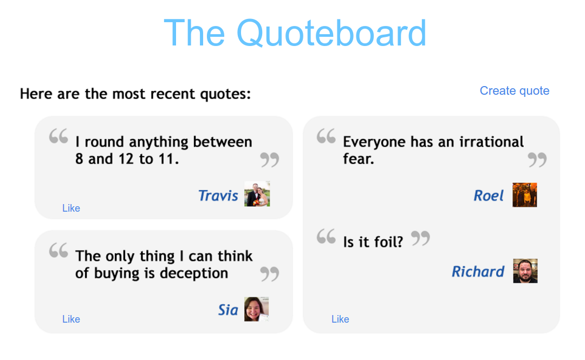

# myquoteboard-sails-react

This is a demo repository, built to show off automated unit testing with ReactJS and [Enzyme](http://airbnb.io/enzyme/index.html). There is a [video](https://www.youtube.com/watch?v=DnWeoMXJBuo) that goes with this demo, or you can [view the slides here](https://docs.google.com/presentation/d/1mJuJFGOzEy07iNVIvn-_OufG_hiC4EjiI6rF7uF1smI/edit?usp=sharing).

## Important note

There's no app here! Not even a semblance of one. Originally I intended to create a real example app, where the backend uses [SailsJS](http://sailsjs.org), but I ran out of time.

To give you an idea of what was meant to be built (a simple app called the Quoteboard, where you capture funny things your friends say), and thus what should be tested, take a look at this picture.



Now see how that breaks down into this structure:

```
<Dashboard>
  <QuoteCollection>
    <Quote>
      <PhraseCollection>
        <Phrase/>
      </PhraseCollection>
    </Quote>
  </QuoteCollection>
</Dashboard>
```

## What benefit does this repo provide then?!

This repo shows a few things:

* First, you can see Test Driven Development (TDD) at work here: tests should be written before the implementation code, because it helps you think about how your code should be designed/organized.
* You can see how to set up karma to watch for your tests (aka "specs", in the `specs` directory) which runs them automatically as you change them.
* Shows how to set up karma + webpack with enzyme, chai, sinon

## How to run (the tests)

1. Clone the repo
1. `cd` into the new directory
1. Run `npm install`
1. Run `npm run karma`

Note how karma automatically watches for changes and re-runs the tests. It runs it through webpack. Take a look in the `karma.conf.js` file for the configuration.

## Where do I look?

Be sure to run the tests. The files to take a look at are:

* The spec directory. Typically, unit tests mirror the app code, in this case what's in the app directory.
* Karma config in `karma.conf.js`.

## Bonus

As you add functionality to an app, your webpack configuration will likely get more complex. If you just change it once and it works perfectly, great. But if you find yourself trying different configuration values to get things working, it can be a pain to keep restarting karma. A solution to this is to install a watcher like [nodemon](https://github.com/remy/nodemon) with e.g. `npm install -g nodemon`, and then run `nodemon node_modules/.bin/karma start`, and whenever you change your karma config, nodemon will restart karma!

## Technologies

* [Facebook React TestUtils](https://facebook.github.io/react/docs/test-utils.html) - The 'base' test functions, provided by Facebook/React. If you use Enzyme, you don't need these, as Enzyme wraps them.
* [Enzyme](http://airbnb.io/enzyme/index.html) - A wrapper library around Facebook's TestUtils. It uses the TestUtils underneath, but makes it much more convenient to traverse your components. Be sure to try out its `debug()`, `text()`, `html()`, and `render()` methods!
* [Chai](http://chaijs.com/api/bdd/) - As "assertion library", which makes your tests easier to read, because they look more like prose/english
* [chai-enzyme](https://github.com/producthunt/chai-enzyme) - Chai for Enzyme makes it easier to read assertions for your React component tests with Enzyme
* [Sinon](http://sinonjs.org/docs/) - create test spies, which is how you know if your methods were called. You can force return values, etc.
* PhantomJS is a headless (or non-visible) browser that karma runs the tests in. You can also configure karma to use another browser, or multiple at once!

## Known shortcomings

I couldn't get the sourcemaps to work. So, if you get an error message, it might tell you some absurdly high line number, which doesn't correlate to any single file. What's happening is webpack is concatenating everything into a bundle (single file with internal structure), so the line number is from that bundle. Ideally a sourcemap would be able to map from that large bundle back to the original source. If anyone knows how to fix it, let me know!

Unfortunately this is not a great example of *what* to test. It's short blurbs to get you started, but doesn't explain how to do things in a real world project, which is something I'd like to cover at some point.

## Questions?

Create a github issue!
